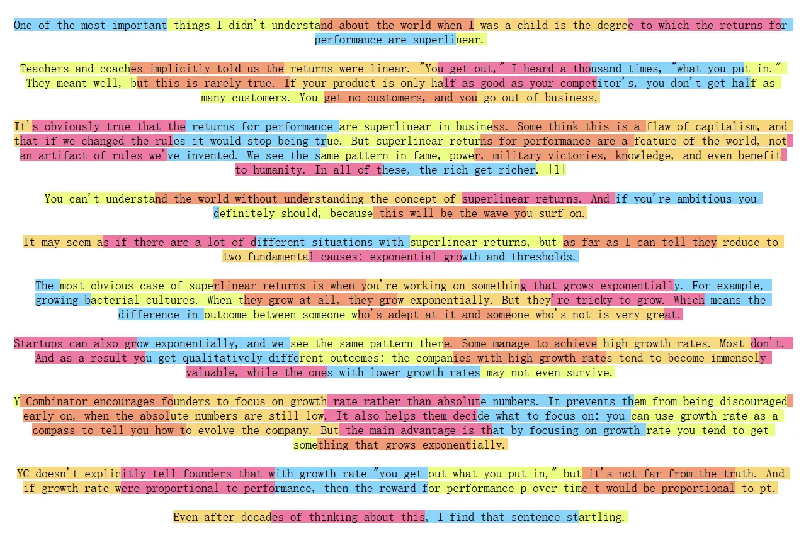

# 文本分块
文本分块是构建RAG流程的关键步骤。加载完文档后，我们需要将长篇文档切分成更小、更易于处理的单元。这些被切分成的文本块，是后续向量检索和模型处理的基本单位。比如下面这个图就是文档被chunk为小处理单元的可视化图。

## 一、为什么要文本分块
主要两大考量因素：模型的**上下文限制**和**检索生成的performance**
### 1.1 满足模型的上下文限制
将文本分块的首要原因，其实还是因为模型性能限制，主要包括以下两个方面。
- 嵌入模型（Embedding Model）：嵌入模型将文本块转换为向量，但是它有严格的输入长度上限。例如，许多常用的嵌入模型（如 bge-base-zh-v1.5）的上下文窗口为512个token。任何超出此限制的文本块在输入时都会被截断，导致信息丢失，生成的向量也无法完整代表原文的语义。因此，文本块的大小必须小于等于嵌入模型的上下文窗口。
- 大语言模型（LLM）：LLM同样有上下文窗口限制（尽管通常比嵌入模型大得多，从几千到上百万token不等）。检索到的所有文本块，连同用户问题和提示词，都必须能被放入这个窗口中。如果单个块过大，可能会导致只能容纳少数几个相关的块，限制了LLM回答问题时可参考的信息广度。
### 1.2 是否“块”越大越好
首先说答案：否！过大的块会严重影响RAG系统的性能。
#### 嵌入过程中的信息损失
我们来从原理上解释一下，大多数嵌入模型都基于 Transformer 编码器。其工作流程大致如下：
- 1.分词 (Tokenization): 将输入的文本块分解成一个个 token。
- 2.向量化 (Vectorization): Transformer 为每个 token 生成一个高维向量表示。
- 3.池化 (Pooling): 通过某种方法（如取[CLS]1位的向量、对所有token向量求平均mean pooling等），将所有 token 的向量压缩成一个单一的向量，这个向量代表了整个文本块的语义。

在这个压缩过程中，信息损失是不可避免的。一个768维的向量需要概括整个文本块的所有信息。**文本块越长，包含的语义点越多，这个单一向量所承载的信息就越稀释**，导致其表示变得笼统，关键细节被模糊化，从而降低了检索的精度。
#### 生成过程的“大海捞针”（Lost in the Middle）
即使将检索到的多个大块文本都塞进LLM的长上下文窗口中，也会出现关键信息被“淹没”在大量无关内容里的问题。有研究表明2，当LLM处理非常长的、充满大量信息的上下文时，它倾向于更好地记住开头和结尾的信息，而忽略中间部分的内容。

如果提供给LLM的上下文块又大又杂，充满了与问题无关的噪音，模型就很难从中提取出最关键的信息来形成答案，从而导致回答质量下降或产生幻觉。

#### 主题稀释导致检索失败
一个好的文本块应该聚焦于一个明确、单一的主题。如果一个块包含太多不相关的主题，它的语义就会被稀释，导致在检索时无法被精确匹配。

## 二、基础分块策略
LangChain提供了丰富且易于使用的文本分割器（Text Splitters），下面介绍几种核心策略。
### 2.1 固定大小分块
这是最简单直接的分块方法。根据LangChain源码，这个方法原理分为两个主要阶段：
- 1.**按段落分割**：`CharacterTextSplitter` 采用默认分隔符 "\n\n"，使用正则表达式将文本按段落进行分割，通过 `_split_text_with_regex` 函数处理。
- 2.**智能合并**：调用继承自父类的 `_merge_splits` 方法，将分割后的段落依次合并。该方法会监控累积长度，当超过 `chunk_size` 时形成新块，并通过重叠机制（`chunk_overlap`）保持上下文连续性，同时在必要时发出超长块的警告。
需要注意，`CharacterTextSplitter`实际实现的并非严格的固定大小分块。根据`_merge_splits`源码逻辑，这种方法会：
- **优先保持段落完整性：**只有当添加新段落会导致总长度超过 `chunk_size` 时，才会结束当前块
- **处理超长段落：**如果单个段落超过 `chunk_size`，系统会发出警告但仍将其作为完整块保留
- **应用重叠机制：**通过 `chunk_overlap` 参数在块之间保持内容重叠，确保上下文连续性
因此，LangChain的实现更准确地应该称为"段落感知的自适应分块"，块大小会根据段落边界动态调整。
**代码示例**
```python
from langchain.text_splitter import CharacterTextSplitter
from langchain_community.document_loaders import TextLoader

loader = TextLoader("../../data/C2/txt/蜂医.txt")
docs = loader.load()

text_splitter = CharacterTextSplitter(
    chunk_size=200,    # 每个块的目标大小为100个字符
    chunk_overlap=10   # 每个块之间重叠10个字符，以缓解语义割裂
)

chunks = text_splitter.split_documents(docs)

print(f"文本被切分为 {len(chunks)} 个块。\n")
print("--- 前5个块内容示例 ---")
for i, chunk in enumerate(chunks[:5]):
    print("=" * 60)
    # chunk 是一个 Document 对象，需要访问它的 .page_content 属性来获取文本
    print(f'块 {i+1} (长度: {len(chunk.page_content)}): "{chunk.page_content}"')
```
### 2.2 递归字符分块
在前面的章节中，已经尝试了使用`RecursiveCharacterTextSplitter` 的默认配置来处理文档分块。现在让我们深入了解 `RecursiveCharacterTextSplitter` 的实现。这种分块器通过分隔符层级递归处理，相对与固定大小分块，改善了超长文本的处理效果。
**算法流程：**
1. **寻找有效分隔符：**从分隔符列表中从前到后遍历，找到第一个在当前文本中**存在**的分隔符。如果都不存在，使用最后一个分隔符（通常是空字符串`""`）。
2. **切分与分类处理：**使用选定的分隔符切分文本，然后遍历所有片段：
  -  **如果片段不超过块大小：** 暂存到`_good_splits` 中，准备合并
  -  **如果片段超过块大小：**
    - 首先，将暂存的合格片段通过`_merge_splits`合并成块
    - 然后，检查是否还有剩余分隔符：
      -  **有剩余分隔符：** 递归调用`_split_text`继续分割
      -  **无剩余分隔符：**直接保留为超长块 
3. **最终处理：**将剩余的暂存片段合并成最后的块

**实现细节：**
- **批处理机制**：先收集所有合格片段（`_good_splits`），遇到超长片段时才触发合并操作。
- **递归终止条件**：关键在于 `if not new_separators`判断。当分隔符用尽时（`new_separators`为空），停止递归，直接保留超长片段。确保算法不会无限递归。

**与固定大小分块的关键差异**：
- 固定大小分块遇到超长段落时只能发出警告并保留。
- 递归分块会继续使用更细粒度的分隔符（句子→单词→字符）直到满足大小要求。

具体示例如下：
```python
from langchain.text_splitter import RecursiveCharacterTextSplitter
from langchain_community.document_loaders import TextLoader

loader = TextLoader("../../data/C2/txt/蜂医.txt")
docs = loader.load()

text_splitter = RecursiveCharacterTextSplitter(
    separators=["\n\n", "\n", "。", "，", " ", ""],  # 分隔符优先级
    chunk_size=200,
    chunk_overlap=10,
)

chunks = text_splitter.split_text(docs)

```
**分隔符配置：**
- **默认分隔符**：`["\n\n", "\n", " ", ""]`
- **多语言支持**：对于无词边界语言（中文、日文、泰文），可添加：
```python
separators=[
    "\n\n", "\n", " ",
    ".", ",", "\u200b",      # 零宽空格(泰文、日文)
    "\uff0c", "\u3001",      # 全角逗号、表意逗号
    "\uff0e", "\u3002",      # 全角句号、表意句号
    ""
]

```
递归字符分块的原理是采用一组有层次结构的分隔符（如段落、句子、单词）进行递归分割，旨在有效平衡语义完整性与块大小控制。在 `RecursiveCharacterTextSplitter` 的实现中，该分块器首先尝试使用最高优先级的分隔符（如段落标记）来切分文本。如果切分后的块仍然过大，会继续对这个大块应用下一优先级分隔符（如句号），如此循环往复，直到块满足大小限制。这种分层处理的机制，能够在尽可能保持高级语义结构完整性的同时，有效控制块大小。

### 2.3 语义分块
语义分块（Semantic Chunking）是一种更智能的方法，这种方法不依赖于固定的字符数或预设的分隔符，而是尝试根据文本的语义内涵来切分。其核心是：**在语义主题发生显著变化的地方进行切分**。这使得每个分块都具有高度的内部语义一致性。

LangChain提供了
`langchain_experimental.text_splitter.SemanticChunker`来实现这一功能。

**实现原理**
SemanticChunker 的工作流程可以概括为以下几个步骤：

1. **句子分割 (Sentence Splitting)**: 首先，使用标准的句子分割规则（例如，基于句号、问号、感叹号）将输入文本拆分成一个**句子列表。**

2. **上下文感知嵌入 (Context-Aware Embedding):** 这是 `SemanticChunker` 的一个关键设计。该分块器不是对每个句子独立进行嵌入，而是通过 `buffer_size` 参数（默认为1）来捕捉上下文信息。对于列表中的每一个句子，这种方法会将其与前后各 `buffer_size` 个句子组合起来，然后对这个**临时的、更长的组合文本进行嵌入**。这样，每个句子最终得到的嵌入向量就**融入了其上下文的语义**。

3. **计算语义距离 (Distance Calculation)**: 计算每对相邻句子的嵌入向量之间的余弦距离。这个距离值量化了两个句子之间的语义差异——距离越大，表示语义关联越弱，跳跃越明显。

4. **识别断点 (Breakpoint Identification)**: `SemanticChunker` 会分析所有计算出的距离值，并根据一个统计方法（默认为 `percentile`）来确定一个动态阈值。例如，它可能会将所有距离中第95百分位的值作为切分阈值。所有距离大于此阈值的点，都被识别为语义上的“断点”。

5. **合并成块 (Merging into Chunks)**: 最后，根据识别出的所有断点位置，将原始的句子序列进行切分，并将每个切分后的部分内的所有句子合并起来，形成一个最终的、语义连贯的文本块。

下面详细说说断点识别方法（`breakpoint_threshold_type`）具体怎么实现的，我们知道这里面其实最难的是如何用一个“好”的定义来定义清楚“显著的语义跳跃”点，`SemanticChunker` 提供了几种基于统计的方法来识别断点：

- `percentile` (百分位法 - **默认方法**):

    - **逻辑**: 计算所有相邻句子的语义差异值，并将这些差异值进行排序。当一个差异值超过某个百分位阈值时，就认为该差异值是一个断点。
    - **参数**: breakpoint_threshold_amount (默认为 95)，表示使用第95个百分位作为阈值。这意味着，只有最显著的5%的语义差异点会被选为切分点。
- `standard_deviation` (标准差法):

    - **逻辑**: 计算所有差异值的平均值和标准差。当一个差异值超过“平均值 + N * 标准差”时，被视为异常高的跳跃，即断点。
    - **参数**: `breakpoint_threshold_amount` (默认为 3)，表示使用3倍标准差作为阈值。
- `interquartile` (四分位距法):

    - **逻辑**: 使用统计学中的四分位距（IQR）来识别异常值。当一个差异值超过 Q3 + N * IQR 时，被视为断点。
    - **参数**: `breakpoint_threshold_amount` (默认为 1.5)，表示使用1.5倍的IQR。
- `gradient` (梯度法):

    - **逻辑**: 这是一种更复杂的方法。它首先计算差异值的变化率（梯度），然后对梯度应用百分位法。对于那些句子间语义联系紧密、差异值普遍较低的文本（如法律、医疗文档）特别有效，因为这种方法能更好地捕捉到语义变化的“拐点”。
    - **参数**: `breakpoint_threshold_amount` (默认为 95)。

**代码例子如下**
```python
import os
## os.environ["HF_ENDPOINT"] = "https://hf-mirror.com"
from langchain_experimental.text_splitter import SemanticChunker
from langchain_community.embeddings import HuggingFaceEmbeddings
from langchain_community.document_loaders import TextLoader

embeddings = HuggingFaceEmbeddings(
    model_name="BAAI/bge-small-zh-v1.5",
    model_kwargs={'device': 'cpu'},
    encode_kwargs={'normalize_embeddings': True}
)

# 初始化 SemanticChunker
text_splitter = SemanticChunker(
    embeddings,
    breakpoint_threshold_type="percentile" # 断点识别方法
)

loader = TextLoader("../../data/C2/txt/蜂医.txt")
documents = loader.load()

docs = text_splitter.split_documents(documents)

```
### 2.4 基于文档结构的分块
对于具有明确结构标记的文档格式（如Markdown、HTML、LaTex），可以利用这些标记来实现更智能、更符合逻辑的分割。

#### 以 Markdown 结构分块为例
针对结构清晰的 Markdown 文档，利用其标题层级进行分块是一种高效且保留了丰富语义的方法。`LangChain` 提供了`MarkdownHeaderTextSplitter` 来处理。

- **实现原理**: 该分块器的主要逻辑是“先按标题分组，再按需细分”。

    1. **定义分割规则**: 用户首先需要提供一个标题层级的映射关系，例如 `[ ("#", "Header 1"), ("##", "Header 2") ]`，告诉分块器 `#` 是一级标题，`##` 是二级标题。
    2. **内容聚合**: 分块器会遍历整个文档，将每个标题下的**所有内容（直到下一个同级或更高级别的标题出现前）聚合在一起**。每个聚合后的内容块都会被赋予一个包含其完整标题路径的元数据。
   
- **元数据注入的优势**: 这是此方法的主要特点。例如，对于一篇关于机器学习的文章，某个段落可能位于“第三章：模型评估”下的“3.2节：评估指标”中。经过分割后，这个段落形成的文本块，其元数据就会是 `{"Header 1": "第三章：模型评估", "Header 2": "3.2节：评估指标"}`。这种元数据为每个块提供了**精确的“地址”**，极大地增强了上下文的准确性，让大模型能更好地理解信息片段的来源和背景。

- **局限性与组合使用**: 单纯按标题分割可能会导致一个问题：某个章节下的内容可能非常长，远超模型能处理的上下文窗口。为了解决这个问题，`MarkdownHeaderTextSplitter` 可以与其它分块器（如 `RecursiveCharacterTextSplitter`）组合使用。具体流程是：

    1. 第一步，使用 MarkdownHeaderTextSplitter 将文档按标题分割成若干个大的、带有元数据的逻辑块。
    2. 第二步，对这些逻辑块再应用 RecursiveCharacterTextSplitter，将其进一步切分为符合 chunk_size 要求的小块。由于这个过程是在第一步之后进行的，所有最终生成的小块都会继承来自第一步的标题元数据。
   
- **RAG应用优势**: 这种两阶段的分块方法，既保留了文档的宏观逻辑结构（通过元数据），又确保了每个块的大小适中，是处理结构化文档进行RAG的理想方案。

## 三、其他开源框架的分块策略
### 3.1  Unstructured：基于文档元素的智能分块
`Unstructured`是一个强大的文档处理工具，同样提供了实用的分块功能。

1. **分区 (Partitioning)**: 这是一个重要功能，负责将原始文档（如PDF、HTML）解析成一系列结构化的“元素”（Elements）。每个元素都带有语义标签，如 `Title` (标题)、`NarrativeText` (叙述文本)、`ListItem` (列表项) 等。这个过程本身就完成了对文档的深度理解和结构化。
2. **分块 (Chunking)**: 该功能建立在分区的结果之上。分块功能不是对纯文本进行操作，而是将分区产生的 **“元素”列表作为输入**，进行智能组合。`Unstructured` 提供了两种主要的分块方法：
    - **basic**: 这是默认方法。这种方法会连续地组合文档元素（如段落、列表项），直到达到 `max_characters` 上限，尽可能地填满每个块。如果单个元素超过上限，则会对其进行文本分割。
    - **by_title**: 该方法在 `basic` 方法的基础上，增加了对 **“章节”** 的感知。该方法将 `Title` 元素视为一个新章节的开始，并**强制在此处开始一个新的块**，确保同一个块内不会包含来自不同章节的内容。这在处理报告、书籍等结构化文档时非常有用，效果类似于 `LangChain` 的 `MarkdownHeaderTextSplitter`，但适用范围更广。

Unstructured 允许将分块作为分区的一个参数在**单次调用**中完成，也支持在分区之后作为一个**独立的步骤**来执行分块。这种 **“先理解、后分割”** 的策略，使得 Unstructured 能在最大程度上**保留**文档的**原始语义结构**，特别是在处理版式复杂的文档时，优势尤为明显。
### 3.2 LlamaIndex：面向节点的解析与转换
`LlamaIndex` 将数据处理流程抽象为对 **“节点（Node）”**的操作。文档被加载后，首先会被解析成一系列的“节点”，**分块只是**节点转换（Transformation）中的**一环**。
LlamaIndex 的分块体系有以下特点：

1. **丰富的节点解析器 (Node Parser)**: LlamaIndex 提供了大量针对特定数据格式和方法的节点解析器，可以大致分为几类：
   - **结构感知型**: 如 `MarkdownNodeParser`, `JSONNodeParser`, `CodeSplitter` 等，能理解并根据源文件的结构（如Markdown标题、代码函数）进行切分。
   - **语义感知型**:
     - `SemanticSplitterNodeParser`: 与 LangChain 的 `SemanticChunker` 类似，这种解析器使用嵌入模型来检测句子之间的语义“断点”，从而在语义最连贯的地方进行切分。
     - `SentenceWindowNodeParser`: 这是一种巧妙的方法。该方法将文档切分成单个的句子，但在每个句子节点（Node）的元数据中，会存储其前后相邻的N个句子（即“窗口”）。这使得在检索时，可以先用单个句子的嵌入进行精确匹配，然后将包含上下文“窗口”的完整文本送给LLM，极大地提升了上下文的质量。
   - **常规型**: 如 `TokenTextSplitter`, `SentenceSplitter` 等，提供基于Token数量或句子边界的常规切分方法。
2. 灵活的转换流水线: 用户可以构建一个灵活的流水线，例如先用 `MarkdownNodeParser` 按章节切分文档，再对每个章节节点应用 `SentenceSplitter` 进行更细粒度的句子级切分。每个节点都携带丰富的元数据，记录着其来源和上下文关系。
3. 良好的互操作性: **LlamaIndex** 提供了 `LangchainNodeParser`，可以方便地将任何 **LangChain** 的 `TextSplitter` 封装成 **LlamaIndex** 的节点解析器，无缝集成到其处理流程中。

### 3.3 ChunkViz：简易的可视化分块工具
在本文开头部分展示的分块图就是通过 ChunkViz 生成的。可以将你的文档、分块配置作为输入，用不同的颜色块展示每个 chunk 的边界和重叠部分，方便快速理解分块逻辑。